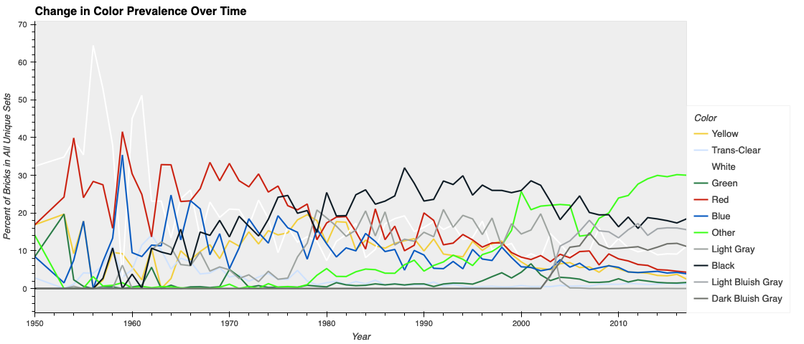
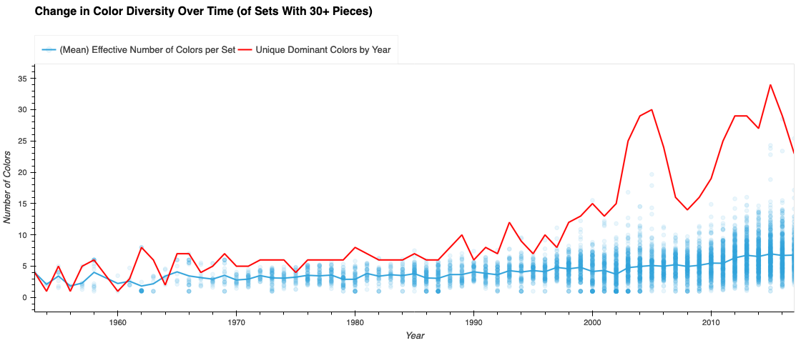

Dear Ex Co.,

I took a look at the Lego data describing pieces per set over time, and dug into the information about changes in color patterns.
The data is available at https://www.kaggle.com/datasets/rtatman/lego-database?resource=download.

As might be expected the four main colors (RGBY), white, black, and shades of grey were once very common. While white, black, and greys have remained reasonably popular, the RGBY colors have gotten progressively less popular over time. Correspondingly, the percent of colors that aren't in these common groups has increased over time. A clear example of this shift is the replacment of light gray by light bluish gray, and introduction of dark bluish gray during the early-2000s.

This raises the question, does the increase in special colors due to a greater diversity of brick colors within sets or a greater diversity in dominant colors among sets.

In this second visual, we can see an increase in the diversity of colors that dominate sets, and a lesser increase in the effective number of colors from ~4 to ~6. This suggests each set still has a few influential colors, but there is greater diversity in the particular colors being used.

We excluded sets with fewer than 30 parts from the second analysis as their effective number of colors is difficult to interpret. This category includes minifigures, key chains, and microscale builds.

The unique dominant colors measure is simply the number of unique colors that are most numerous in at least one set. So if we had two very red, and one very blue sets the unique dominant colors would be 2.  The effective number of colors metric is best explained with an example. Imagine, you have built a Lego set, and decide to include a minifigure who's top is a new color. While the total number of colors in your build has increased, if you take a step back, the most prevalent colors are still the same. Our effective number of colors metric reflects the number of important color shades.

Best,
Chad
